# Git

## First Time Git Setup

1. Initialize local repository

   ~~~bash
   $ git init
   #nevigate to the project folder on which versioning need to be done
   ~~~

2. Add file to index

   [Git add documentation](https://git-scm.com/docs/git-add)

   ~~~bash
   $ git add <file>  # to add one file to index
   $ git add .  #to add all the files to index 
   ~~~

3. Add user client config

   [Git configuration](https://git-scm.com/book/en/v2/Customizing-Git-Git-Configuration)

   ~~~bash
   # to list out all the git config
   $ git config --list
   
   # to find the location of all the configuration
   $ git config --list --show-origin
   
   # add user name
   $ git config --global user.name "User Name"
   
   # add user email
   $ git config --global user.email userEmail@demo.com
   ~~~

   [Writting good commits](https://medium.com/compass-true-north/writing-good-commit-messages-fc33af9d6321)

   [custom git commit template](https://backlog.com/blog/git-commit-messages-bold-daring/)

   Global default commit message

   ~~~bash
   # create the .gitmessage in root directory
   $ nano .gitmessage # to create the file, copy the "template" of this diretory in .gitmessage file
   
   # check whether template set successfully
   $ git config commit.template
   output >> .\.gitmessage  # then commit message template is set correctly
   ~~~

   Repo wise default commit message

   ~~~bash
   # create and edit commitmsg.txt file in local repo
   # add the commitmsg.txt in .gitignore
   
   # set local commitmsg.txt
   $ git config --local commit.template "absolute path name of the commitmsg.txt"
   
   # to check the commitmsg file set correctly 
   $ git config --local commit.template
   >> will return the file path of commitmsg.txt
   ~~~

4. Restored the staged file to unstaged area in index

   ~~~bash
   $ git restore --staged <file>
   ~~~

5. .gitIgnore

   [Git ignore documentation](https://www.atlassian.com/git/tutorials/saving-changes/gitignore)

   When ignoring file is not tracked

   ~~~bash
   # 1 # create .gitignore file
   $ nano .gitignore
   # 2 # edit the .gitignore file [add the file which need to be ignored]
   # 3 # save it, in further commits it will not be tracked
   ~~~

   When ignoring file is being tracked previously

   ~~~bash
   #conside secondIgnore.txt is previously tracked
   
   # 1 # add that file into .gitignore using text editor
   # 2 # remove the secondIgnore.txt file from index with following command
   $ git rm --cached secondIgnore.txt
   
   # 3 # check the index status
   $ git status
   >> modified:   .gitignore
   >> deleted:    secondIgnore.txt
   
   # 4 # update the .gitignore in index
   $ git add .gitignore
   $ git commit  # add the commit msg in text
   ~~~

6. Committing the changes in Index

   [git commit documentation](https://git-scm.com/docs/git-commit)

   ~~~bash
   $ git commit
   ~~~

7. Remote repository commands

   [Git remote documentation](https://git-scm.com/docs/git-remote)

   ~~~bash
   
   $ git push #push the changes to the remote repo
   $ git pull #pull changes from remote repo
   # fetc+merge is reccomended 
   
   $ git remote [-v | --verbose] #list all remote repo [push and pull]
   
   $ git remote add [-t <branch>] [-m <master>] [-f] [--[no-]tags] [--mirror=<fetch|push>] <name> <url>
   
   $ git remote rename <old> <new>
   
   $ git remote remove <name>
   
   $ git remote set-head <name> (-a | --auto | -d | --delete | <branch>)
   
   $ git remote set-branches [--add] <name> <branch>…​
   
   $ git remote get-url [--push] [--all] <name>
   
   $ git remote set-url [--push] <name> <newurl> [<oldurl>]
   
   $ git remote set-url --add [--push] <name> <newurl>
   
   $ git remote set-url --delete [--push] <name> <url>
   
   $ git remote [-v | --verbose] show [-n] <name>…​
   
   $ git remote prune [-n | --dry-run] <name>…​
   
   $ git remote [-v | --verbose] update [-p | --prune] [(<group> | <remote>)…​]
   ~~~

8. Cloning the repository from remote server

   [Git clone documentation](https://git-scm.com/docs/git-clone)

   ~~~bash
   $ git clone
   ~~~

## Branching Strategy

1. [Tool to practice branching ](https://git-school.github.io/visualizing-git/#free)

2. When new git repo initialize only master branch present at that moment

3. It good practice to make a branch out of master for further development

   ~~~bash
   $ git init
   $ git add doc1
   $ git commit 
   # HEAD represents on which branch you are now [we are on master]
   ~~~

   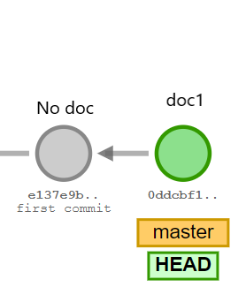

4. Adding branch B1

   ~~~bash
   $ git branch B1
   
   # to check how many branches
   $ git branch  
   >>	B1
   >>  * master		# star represent HEAD which is on master branch
   
   $ git add masterDoc1	 # this doc will be reflected only on master branch
   $ git commit			# this commit will be indexed on master branch
   
   # to check how many branches are in remote
   $ git branch -r
   >>	origin/B1
     	origin/master
   ~~~

   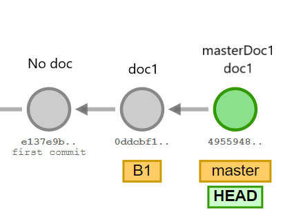

5. Change the head to branch B1 and commit changes at branch B1

   ~~~bash
   $ git checkout B1 		# change Head from master to B1
   $ git branch   # to confirm the Head is on B1
   
   $ git add doc2		    # this fill will be inserted on branch B1
   $ git commit			    # file doc2 will not be reflected on master branch
   
   # some changes in file
   $ git commit				# this commite will be apply to branch B1
   
   # add one more file to the branch B1
   $ git add B1doc3
   $ git commit
   ~~~

   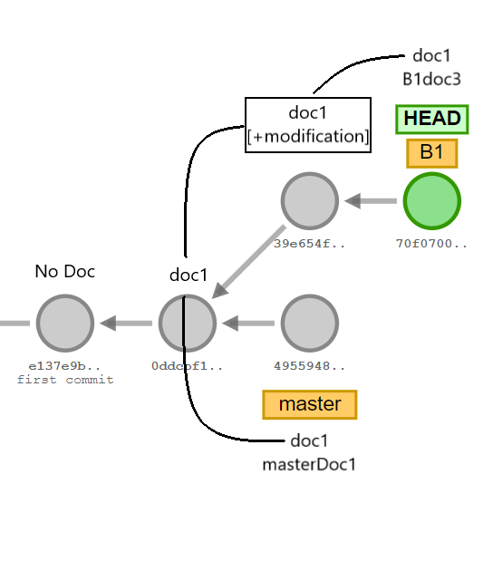

6. Lets add one more branch from master

   ~~~bash
   $ git checkout master		 # changing the head to master from B1
   $ git branch 			  	# check whether head is on itended branch
   
   $ git branch B2			# add B2 branch from master
   $ git checkout B2			# bring the Head to branch B2
   
   $ git add B2doc3 				    # add file name B2doc3 on branch B2
   $ git commit	"5d28802.."			# commit the B2doc3 
   
   # add some more changes at B2
   $ git commit 	"09060a4.."				
   
   # change head to master and add one file at master
   $ git checkout master
   $ git add Mdoc4
   $ git commit	"3f42d0d.."		
   $ git commit 	"a4d2eb2.."			
   
   
   ~~~

   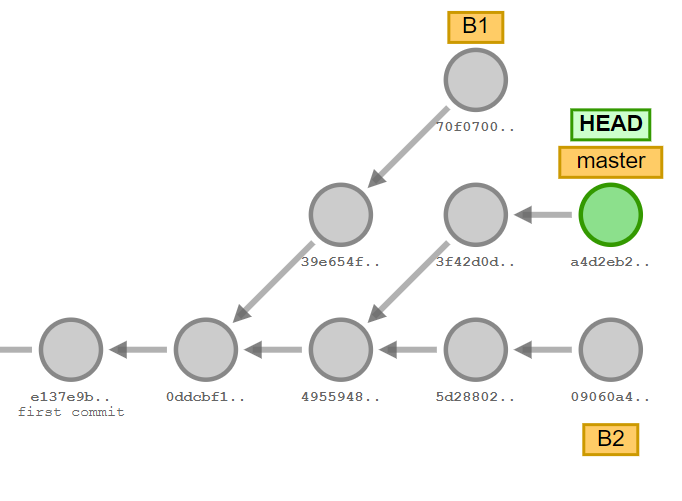

7. Content of all the branches

   ~~~bash
   Branch : Master
   	doc1  
   	masterDoc1  
   	Mdoc4
   Branch : B1
   	B1doc3  
   	doc1  
   	doc2
   Branch : B2
   	B2doc3
       doc1  
       masterDoc1
   ~~~

## Merging

1. Merge the branches [3 -way merge]

   [git merge tutorial](https://www.atlassian.com/git/tutorials/using-branches/git-merge)

   ~~~bash
   $ git checkout "RECEIVING BRANCH"  # eg. master
   $ git merge "SENDING BRANCH" # eg. B1
   # merge always update the current branch where is head present
   ~~~

   Example 

   ~~~bash
   # merge the branch B2 in to B1
   [B2] => [B1]
   
   # 1 # confirm the receiving branch in our case B1
   $ git branch
   >> B1
      *B2			// star means head is on B2
      master
   
   # 2 # if head is not on receiving branch then perform the checkout 
   $ git checkout B1
   
   # 3 # Update the receiving branch with all the latest commits
   # which are made on the receiving branch
   $ git fatch
   $ git pull
   
   # Now receiving branch is ready to recceive the merge
   
   # 4 # perform the mearg
   $ git merge B2
   
   # 5 # feature added on branch B1
   $ git add 
   $ git commit -m "new feature added o branch B1"
   
   # 6 # now merge the latest B1 branch into master
   [B1] => [master]
   $ git checkout master
   $ git merge B1
   ~~~

   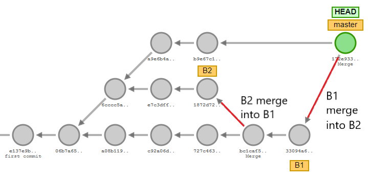

2. content of all the branches after [B2 -> B1 merge]

   ~~~bash
   # comppare it with section 7
   Branch : Master
   	doc1  
   	masterDoc1  
   	Mdoc4
   Branch : B1
   	B1doc3
   	"B2doc3" 
   	doc1       
   	doc2      
   	"masterDoc1" 
   Branch : B2			
   	doc1             
       masterDoc1 
       B2doc3 
   ~~~

3. Content of all the branches after [B1 -> master merge]

   ~~~bash
   Branch : Master
   	doc1  
   	masterDoc1  
   	Mdoc4
   	"B1doc3"  
   	"B2doc3"
   	"doc2"
   Branch : B1
   	B1doc3
   	B2doc3 
   	doc1       
   	doc2      
   	masterDoc1 
   Branch : B2			
   	doc1             
       masterDoc1 
       B2doc3 
   ~~~

4. Fast Forward Merging 

   Fast forward merging occures when there is a linear path from current branch to the target branch

   Before fast forward merging

   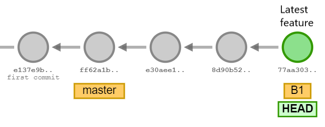

   After fast forward merging

   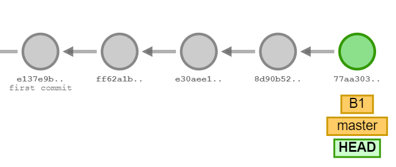

5. Merging from remote branch

   Consider you are in Branch B1 on local repository, and someone made changes in branch B2 located on remote repo and you want to have that changes on the branch B1 of the local repo,  consider following procedure

   ~~~bash
   $ git branch		# show all the branches on local repo
   >> B1
   >> B2
   >> *master
   
   $ git branch -r      # show all the branches on remote repo
   >> origin/B1
   >> origin/B2
   >> origin/master
   
   ## to take the changes happened on origin/B2 and put it on B1
   $ git checkout B1
   
   $ git fetch origin B2 	# will fetch the changes made at origin/B2 into local repo
   $ git merge origin/B2
   ~~~
   

## Resolving merge conflicts

1. [Detail on merge conflict](https://www.atlassian.com/git/tutorials/using-branches/merge-conflicts)

2. Conflict occures when the two branches you are trying to merge, both changed the same part of the same file

3. git unable to resolve such conflicts, hence conflicts need to resolve manually

4. Two types of merge conflicts 

   1. **Git failed to start the merge** : due to untracked changes in working branch
   2. **Git failed during the merge** : due to conflict between branches which are being merged

5. Git will try the best to resolve the second kind of conflicts.

6. In extreme case this merge need to be resolve manually

7. How git represent the merge conflict

   ~~~bash
   $ git status
   On branch master
   You have unmerged paths.
   (fix conflicts and run "git commit")
   (use "git merge --abort" to abort the merge)
   Unmerged paths:
   (use "git add <file>..." to mark resolution)
   both modified:   "file who has conflict"
   
   $ nano " file which has conflict"
   <<<<<<< HEAD
   # content that exist in current branch [eg. master]
   # head is indication that this text is in target brancch
   =======
   # this content is in the branch which need to be merge to the target branch  
   >>>>>>> "mergingBranch"
   
   ~~~

## Detached Head

1. Git checkout command bring the head to the latest commit of the mentioned branch

2. By Detached Head method user can navigate on the branch on the basis of mentioned commit

3. By specifying the SHA1 hash of a specific commit you can access that commit

4. This method is called [detached head](https://www.git-tower.com/learn/git/faq/detached-head-when-checkout-commit)

   ~~~bash
   # bring the head to the specified branch
   $ git checkout "branch name"
   
   # bring the head to the sspecified COMMIT of that branch
   $ git checkout "SHA1 of commit"
   $ git checkout "56a4e5c08"
   ~~~

## Fetch vs. Pull

1. [Pull](https://www.atlassian.com/git/tutorials/syncing/git-pull): **retrieve the changes** which are happen on remote repo and **apply it** directly to the local repo

2. [Fetch](https://www.atlassian.com/git/tutorials/syncing/git-fetch): Only **retrieve the changes** which are happen on remote repo but **does not apply** it on local repo

3. [How to see the differences between fetched data and data of current repo](https://www.git-tower.com/learn/git/ebook/en/command-line/advanced-topics/diffs)

   ~~~bash
   $ git  fetch
   $ git diff "localBranch".."origin/RemoteBranch"
   # Example 1: [local B1] diff [remote B1]
   $ git diff B1..origin/B1 
   # it will show the difference between local B1 branch and remote B1 branch
   
   # example 2: [local B1] diff [remote master]
   $git diff B1..origin/master 
   # it will show the difference between local B1 branch and remote master branch
   
   # to see the log of commits
   $ git log
   
   # once fetch is executed perform merge
   $ git merge
   # check 5th point on merging section
   ~~~

## [Pushing to Remote Repo](https://www.atlassian.com/git/tutorials/syncing/git-push)

1. Counter part of git fetch, used to transfer changes from local to remote repo

2. Pushing has the potential to overwrite changes, caution should be taken when pushing 

3. Commands

   ~~~bash
   $ git push "name of remote" "name of branch"
   # above command will send the changes to mentioned branch of remote repo
   # This creates a local branch in the destination repository
   # To prevent you from overwriting commits, Git won’t let you push when it results in a non-fast-  # forward merge in the destination repository.
   
   $ git push "name of remote" --force
   # even though above mentioned conditions arieses force push will push regardless of  consequences 
   
   ~~~

## [Cherry Pick](https://www.atlassian.com/git/tutorials/cherry-pick)

1. Cherry picking is the act of picking a commit from a branch and applying it to another.

2. Say a commit is accidently made to the wrong branch. You can switch to the correct branch and cherry-pick the commit to where it should belong.

3. commands

   ~~~bash
   $ git cherry-pick "commit ref."
   # commit ref. can be found using git log
   
   # 1 # bring the head to the destination branch where you want to bring the change
   $ git checkout "destination branch"
   
   # 2 # perform cherry pick the commit
   $ git cherry-pick "commit reg. regardless of branch"
   ~~~

## [Difference between fork and clone](https://opensource.com/article/17/12/fork-clone-difference)

1. Fork: To "fork" means to take a copy of the project, rename it, and start a new project and community around the copy 

2. Clone: To copy the remote repo to the local machine

   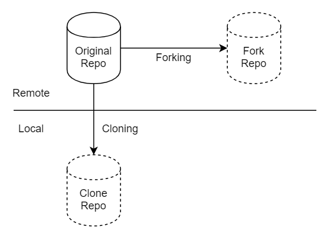

## [Merge vs. Rebase](https://www.atlassian.com/git/tutorials/merging-vs-rebasing)

1. Both the commands are designed to integrate changes from one branch to another branch

2. But they do it different way

3. Merging is non destructive because the branch which got merge will still have one copy of it

4. In following example after feature branch merges to master, feature branch will still be there

5. Rebasing brings entire feature branch on the tip of master branch

6. Rebasing results into much cleaner and perfectly linear project history

7. Rebasing re write the project history, which can be potentially catastrophic for collaborative workflow

8. After Merging two branches

   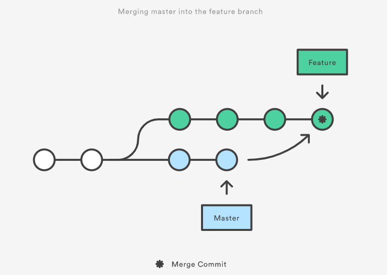

9. After Rebasing two branches

   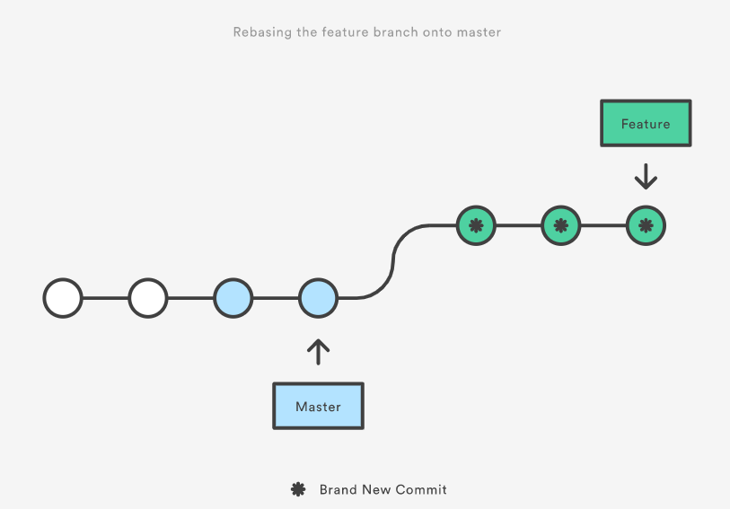

## [Squashing the commit](https://www.atlassian.com/git/tutorials/rewriting-history#git-rebase-i)

1. **Squashing a commit** means, from an idiomatic point of view, to move the changes introduced in said commit into its parent so that you end up with one commit instead of two (or more). 

2. If you repeat this process multiple times, you can reduce *n* commit to a single one.

3. Squashing on master [single branch scenario]

   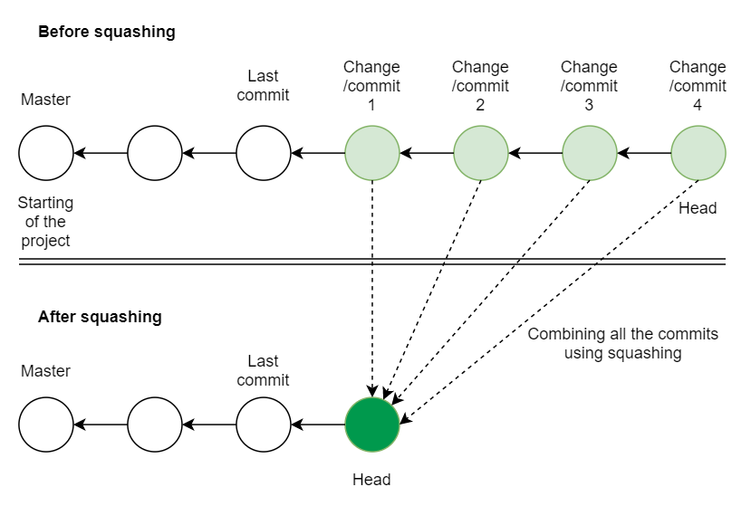

4. [interactive Rebasing](https://hackernoon.com/beginners-guide-to-interactive-rebasing-346a3f9c3a6d)

   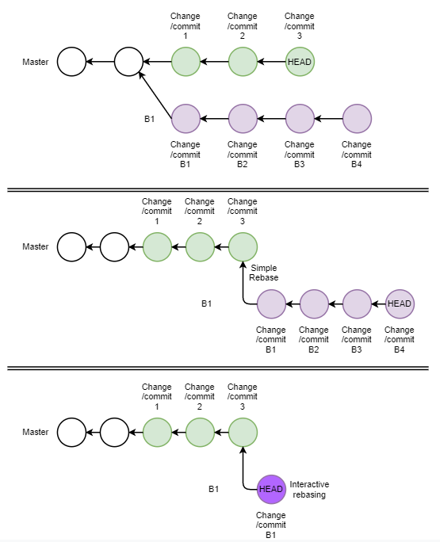

   

## [Git Workflow]([https://www.atlassian.com/git/tutorials/comparing-workflows/gitflow-workflow#:~:text=Gitflow%20Workflow,framework%20for%20managing%20larger%20projects.](https://www.atlassian.com/git/tutorials/comparing-workflows/gitflow-workflow#:~:text=Gitflow%20Workflow,framework%20for%20managing%20larger%20projects.](https://www.atlassian.com/git/tutorials/comparing-workflows/gitflow-workflow#:~:text=Gitflow Workflow,framework for managing larger projects.](https://www.atlassian.com/git/tutorials/comparing-workflows/gitflow-workflow#:~:text=Gitflow Workflow,framework for managing larger projects.))

1. A Git Workflow is a recipe or recommendation for how to use Git to accomplish work in a consistent and productive manner.

2. Things to consider while evaluating workflow

   1. Does this workflow scale with team size?
   2. Is it easy to undo mistakes and errors with this workflow?
   3. Does this workflow impose any new unnecessary cognitive overhead to the team?

3. Types of workflow

   1. Basic

      

   2. [Feature branch](https://www.atlassian.com/git/tutorials/comparing-workflows/feature-branch-workflow)

      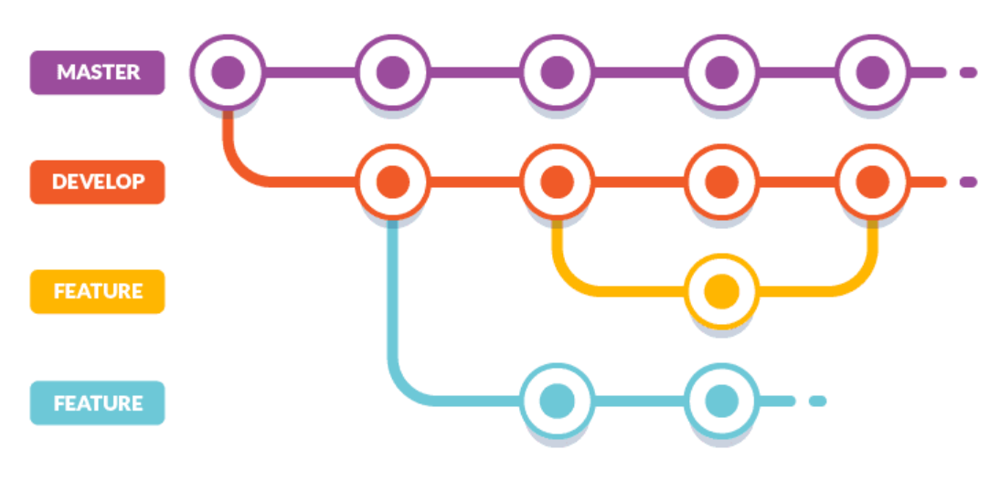

   3. [GitFlow](https://medium.com/@hengfeng/a-review-of-git-workflow-management-7f9fbebd9370)

      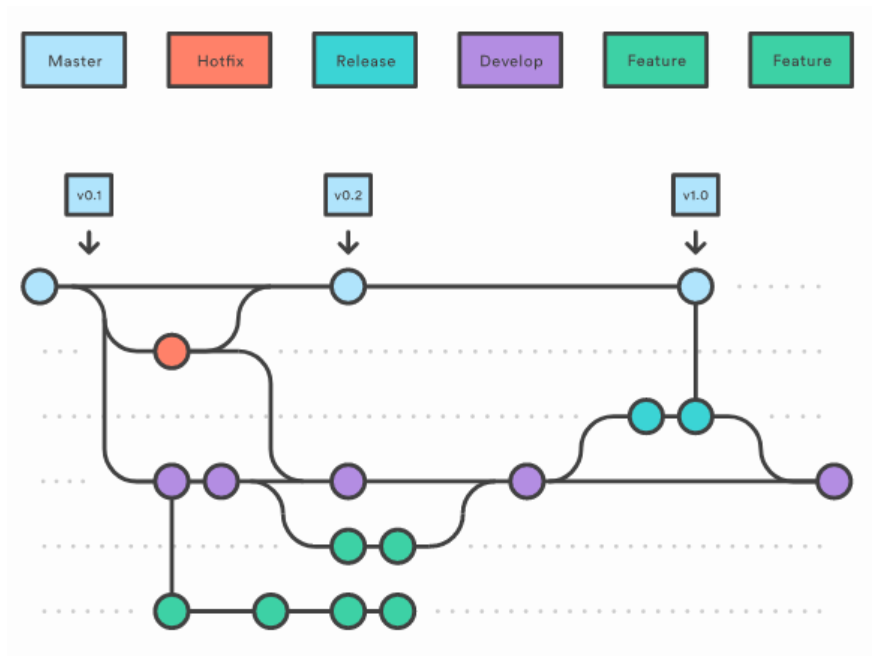

   4. [Forking workflow](https://docs.rhodecode.com/RhodeCode-Enterprise/collaboration/workflow-fork.html)